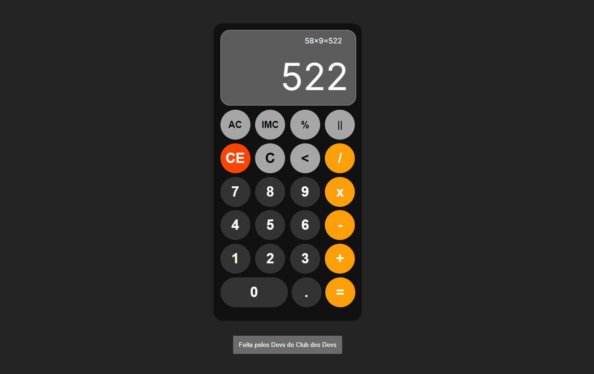

# Calculadora dos Devs

Calculadora feita durante a resenha com os membros da Varanda do Discord do Club dos Devs.



## Demo

https://calculadora-dos-devs.vercel.app/


## Rode Localmente

Clone o projeto

```bash
  git clone https://github.com/plfmoura/calculadora-dos-devs.git
```

Entre no diretório do projeto

```bash
  cd calculadora-dos-devs
```

Instale dependências

```bash
  npm install
```

Rode o projeto

```bash
  npm run dev
```


## Autores

- [@smksouza](https://www.github.com/smksouza)
- [@cfiass](https://www.github.com/cfias)
- [@devmartins03](https://www.github.com/devmartins03)
- [@plfmoura](https://www.github.com/plfmoura)
- [@plfmoura2](https://www.github.com/plfmoura2)
- [@sampconrad](https://www.github.com/sampconrad)


## Agradecimentos

 - [Micael Mota](https://devmicaelomota.com.br/)
 - [Congenial](https://congenial.com.br/)
 - [Club Dos Devs](https://discord.gg/CP4B92jjYZ)


## Contribuindo

Contribuiçoes são sempre bem vindas!

Veja [`CONTRIBUTING.md`](./CONTRIBUTING.md) para ver como contribuir para este projeto.

Por favor, se atente ao `código de conduta` deste projeto.


## Tech Stack


